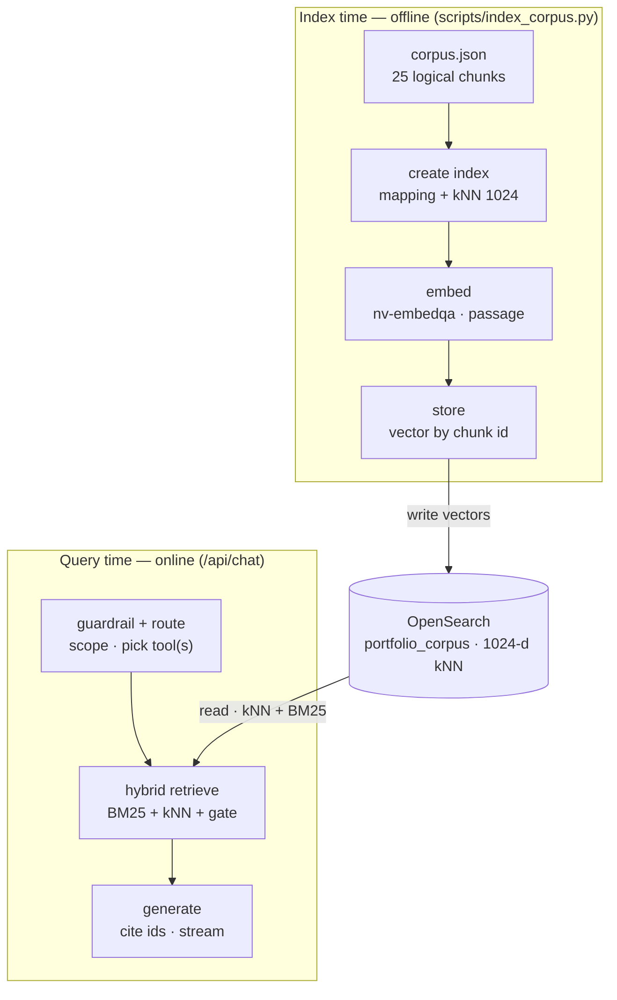

# RAG data pipeline — how data is chunked, embedded, and retrieved

This document traces the data end to end. There are two pipelines: an offline
**index-time** pipeline that fills the store once, and an online **query-time**
pipeline that runs on every question and reads back from that same store.

For the endpoint contract, SSE event shapes, and curl examples, see [RAG.md](RAG.md).



## Phase 1 — Index time (offline, `scripts/index_corpus.py`)

### 1. "Parsing" / chunking — done by hand, not by a splitter

A deliberate design choice from the spec: **one chunk per logical idea, not fixed
token windows.** So there is no PDF/HTML parser and no token-window splitter. The
corpus lives as pre-chunked JSON in `corpus/corpus.json` — **25 objects**, one per
self-contained idea (roughly 200 to 400 words). Each object:

```json
{
  "id": "reveal-decision-01",
  "source_type": "projects",
  "title": "Reveal",
  "section": "decision",
  "text": "The hardest decision on Reveal was ...",
  "url": "https://github.com/...",
  "tags": ["framework-free", "tool-routing"]
}
```

- `id` — stable, used for citations (`[reveal-decision-01]`).
- `source_type` — one of `projects | talks | resume | about | courses`; drives routing.
- `section` — labels the idea: `purpose | stack | role | decision | result | takeaway | bio | contact | summary`.
- `text` — the chunk body, analyzed for BM25.
- `url`, `tags` — citation link and optional filter terms.

Distribution: projects 13, about 4, resume 3, talks 3, courses 2.

### 2. Index creation

The script creates the `portfolio_corpus` index with this mapping:

- `id`, `source_type`, `section` → `keyword` (exact filtering).
- `title` → `text` with a `keyword` subfield.
- `text` → analyzed `text` (BM25).
- `embedding` → `knn_vector`, **dimension 1024**, HNSW graph, **lucene** engine,
  **cosinesimil** space. (Lucene engine because Aiven runs OpenSearch 3.x, which
  removed the older `nmslib` engine.)
- Index setting `index.knn: true`.

### 3. Embedding

Each chunk's `text` is embedded with `nvidia/nv-embedqa-e5-v5` using
**`input_type: "passage"`** (documents), batched. This is the asymmetric part:
passages are embedded differently from queries. 1024 is the model's native
dimension (E5-large hidden size), not a tunable — see the embedding note below.

### 4. Store

Each chunk is bulk-indexed keyed by its `id`, with the 1024-float vector stored in
`_source.embedding` alongside the original fields.

## Phase 2 — Query time (online, `src/lib/rag/`)

Entry point: `POST /api/chat` → `ragStream()` in `answer.ts`, streamed back as SSE.

1. **Guardrail** (`guardrail.ts`) — before any retrieval. A keyword fast-path
   (project names / topics) passes obvious in-scope questions instantly; otherwise
   the model classifies in/out of scope. Out of scope → one fixed refusal line, no
   retrieval, no citation.
2. **Tool routing** (`tools.ts`, `answer.ts`) — the model, via tool-calling, picks
   one or more of `search_projects | search_talks | get_resume_section |
   search_about | get_contact`. Each tool is bound to a `source_type` filter and
   writes the retrieval `query` string. Comparison questions trigger multiple tool
   calls (plan-then-answer). `get_contact` is the one tool that skips OpenSearch and
   synthesizes a contact chunk from the site data.
3. **Hybrid retrieval** (`opensearch.ts` → `hybridSearch`) per tool:
   - Embed the query with **`input_type: "query"`** → 1024-d vector.
   - One OpenSearch request:
     `bool { filter: source_type, should: [ BM25 multi_match on title^2 + text, kNN on embedding ] }`,
     over-fetching `max(k*4, 12)` candidates so a strong lexical match is not missed.
   - Re-score each hit two ways: **cosine(query, chunk-embedding)** in JS (the
     confidence signal) and the **normalized hybrid `_score`** (the ranking signal).
     Sort by ranking, keep top `k` (4).
4. **Merge + confidence gate** (`answer.ts`) — dedupe hits across tools by `id`,
   sort by ranking, take top 6. If the best **cosine < 0.18** (or nothing retrieved)
   → the same fixed refusal. This is the "never fabricate on weak retrieval" backstop.
5. **Grounded generation** (`answer.ts`, `llm.ts`) — the top chunks are formatted as
   context (`[id] (source_type/section) title\n text ...`) and sent to the model at
   `temperature 0` with a system prompt: answer only from these chunks, cite the ids
   inline, say "I do not know" if unsupported. Tokens stream back.
6. **Response** (`route.ts`) — streamed as SSE: `tools` → `citations` → `token...`
   → `done` (or `refusal` / `error`).

## A concrete trace

Question: *"What was the hardest decision on Reveal?"*

1. Guardrail: keyword `reveal` matches → in-scope, no model call.
2. Route: `search_projects(query="Reveal hardest technical decision")`.
3. Retrieve: query embedded → hybrid search filtered to `source_type=projects` →
   over-fetch 12, cosine-rescore, top 4. `reveal-decision-01` ranks first (cosine ≈ 0.4).
4. Gate: best cosine 0.4 ≥ 0.18 → proceed.
5. Generate: the chunk text becomes context; the model writes the answer citing
   `[reveal-decision-01]`, streamed as SSE.

## Three design decisions worth knowing

- **Chunking is semantic, not mechanical.** No token-window splitter; each chunk is
  one self-contained idea keyed by `(source_type, section)`. A citation therefore
  points at exactly one coherent claim, not a random slice.
- **`source_type` does double duty.** It is both the routing target (the tool picks
  it) and an OpenSearch keyword filter, so `search_talks` physically cannot return a
  project chunk. Routing narrows the search space before ranking runs.
- **Two scores for two jobs.** Ranking uses the hybrid BM25 + kNN `_score` (so a
  strong lexical hit like "2000 RPS" survives); the confidence gate uses raw
  **cosine** (interpretable, comparable across tools, thresholded at 0.18). Conflating
  them caused an early round of false refusals.

## Embedding note (why 1024, and the query/passage split)

`nv-embedqa-e5-v5` is NVIDIA NeMo Retriever's QA embedding model, built on the E5
encoder. Its output dimension is fixed at **1024** (the E5-large hidden size), so
`EMBEDDING_DIM=1024` is a declaration that must match what the model emits, not a
size knob. It does not support Matryoshka truncation; to get smaller vectors you
would switch models (for example `nvidia/llama-3.2-nv-embedqa-1b-v2`, which supports
384 / 512 / 768 / 1024 / 2048). At 25 chunks the dimension is immaterial, so 1024 is
kept for quality.

The model is asymmetric: **documents** are embedded with `input_type=passage` at
index time, **queries** with `input_type=query` at search time — same model, both
sides matched. Changing the embedding model or dimension requires a re-index.

## File map

| File | Role |
|------|------|
| `corpus/corpus.json` | The corpus: one object per logical chunk |
| `scripts/index_corpus.py` | Build the index + embed + load (index-time pipeline) |
| `scripts/eval.py` | Hand-rolled grounding eval (routing, grounding, faithfulness, guardrail) |
| `src/app/api/chat/route.ts` | Serverless endpoint, SSE streaming |
| `src/lib/rag/answer.ts` | Orchestration: guardrail → route → retrieve → gate → generate |
| `src/lib/rag/guardrail.ts` | Out-of-scope relevance check |
| `src/lib/rag/tools.ts` | Tool definitions + executors (each maps to a `source_type` query) |
| `src/lib/rag/opensearch.ts` | Hybrid BM25 + kNN search, cosine re-scoring |
| `src/lib/rag/embeddings.ts` | Query/passage embeddings (provider-configurable) |
| `src/lib/rag/llm.ts` | Generation (NIM primary, OpenAI optional fallback) |
