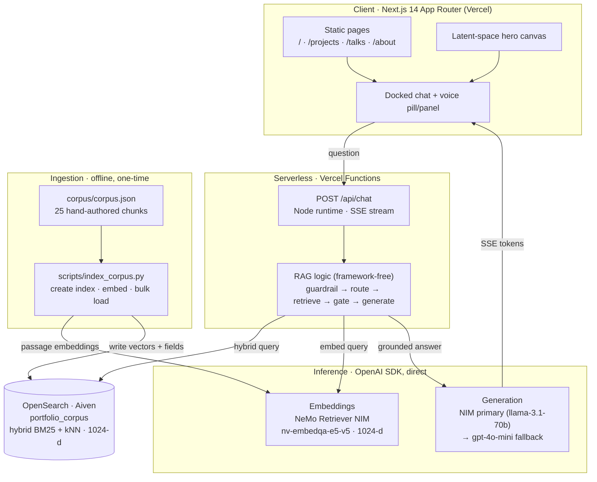
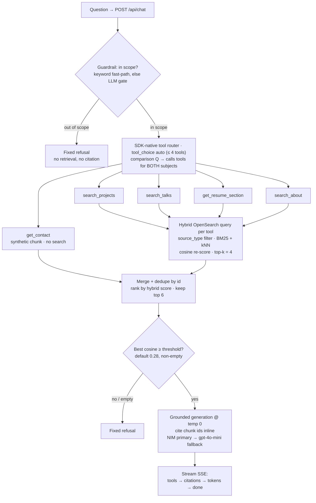
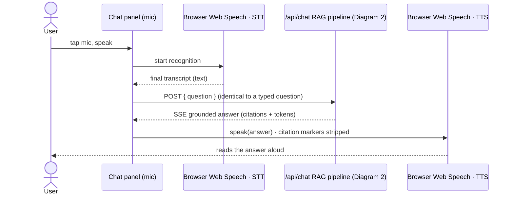

# Rajani Maski — portfolio

Resume-first portfolio with an optional grounded chat + voice assistant. Dark,
calm, one-glance. The landing is the resume; the AI is a reward for the curious,
never imposed.

Live: https://rajanimaskiportfolio.vercel.app

## Stack

- **Next.js 14** App Router, TypeScript, deployed on **Vercel**.
- **Tailwind** + shadcn/ui foundations, dark design tokens (one accent `#5dcca5`).
- **RAG**: OpenAI SDK + **OpenSearch** (BM25 + kNN hybrid). **NVIDIA NIM** primary
  for embeddings and generation, OpenAI optional fallback. **No LangChain /
  LlamaIndex / LangSmith** — framework-free is the deliberate position.
- **Voice**: browser Web Speech API (STT + TTS). Zero extra infra.

## Routes

- `/` landing (hero latent-space canvas, positioning, current work, chat invite)
- `/projects` filterable grid (active + past)
- `/talks` talks, writing, certifications strip
- `/about` running, hiking, autism advocacy
- `/api/chat` RAG endpoint with SDK-native tool routing (SSE) — see [RAG.md](RAG.md)

Chat + voice is a persistent docked pill, not a route.

## Develop

```bash
npm install
npm run dev        # http://localhost:3000
npm run build      # production build (runs lint + typecheck)
```

> Do not run `npm run build` while `npm run dev` is running — both write `.next`
> and the prod build will clobber the dev server's asset manifest.

## RAG backend

The chat endpoint needs three things provisioned (see [`.env.example`](.env.example)):

1. An **OpenSearch** instance with the kNN plugin (Aiven, AWS OpenSearch, or
   self-hosted via Docker). Set `OPENSEARCH_URL`.
2. A **NVIDIA NIM** API key (free credits at build.nvidia.com). Set `NIM_API_KEY`.
3. Edit `corpus/corpus.json` with real content (the drafts are placeholders),
   then build the index and run the grounding eval:

```bash
pip install -r scripts/requirements.txt
python scripts/index_corpus.py --recreate     # create index + load corpus
CHAT_URL=http://localhost:3000/api/chat python scripts/eval.py
```

In production, add the same env vars in the Vercel project settings. Until they
are set, the endpoint returns the fixed refusal / a graceful error and the rest
of the site works unchanged.

Full architecture, SSE event shapes, and curl examples: [RAG.md](RAG.md).

## Architecture

Three focused diagrams, each answering one reviewer question. They render natively
on GitHub and track the shipped code (framework-free, OpenAI SDK used directly,
OpenSearch as the retrieval layer, NeMo Retriever embedding NIM, NIM-primary
generation with an OpenAI fallback, browser Web Speech for voice). It is RAG with
SDK-native tool routing, not a ReAct agent.

### 1. System architecture — the layers and what they are built with



*Client and serverless functions on Vercel; OpenSearch is the retrieval layer; the
embedding and generation NIMs are reached through the OpenAI SDK. The offline
indexing script is a separate ingestion path that fills the store once.*

### 2. Request + agent workflow — how one question is answered



*The guardrail exits early on out-of-scope questions. The router picks targeted
tools (planning both subjects for a comparison), each runs a filtered hybrid query,
and a cosine confidence gate refuses rather than fabricate on weak retrieval.*

### 3. Voice integration — a second front door to the same agent



*Voice is only a second input path: speech becomes text and enters the exact same
pipeline as a typed question. There is no separate voice backend.*

A standalone dark-themed render of Diagram 1 (for optional landing-page use) lives at
[`public/architecture.svg`](public/architecture.svg).

## Content

Site copy and project data live in `src/lib/content.ts`. Items marked `TODO`
(GitHub/LinkedIn handles, project links, one-liners) are placeholders to confirm.
Replace `public/resume.pdf` and the portrait placeholder in
`src/components/portrait.tsx` with the real assets.

## Writing style

No apostrophe-contractions and no dashes in user-facing prose. One accent color,
used only where it means something. Two font weights site-wide (400 / 500).
